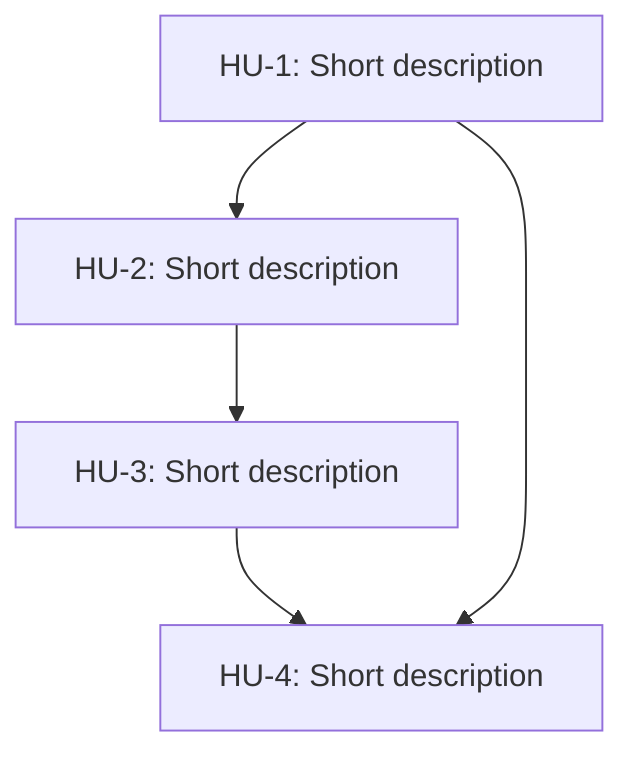

# Project Roadmap

Reads and writes `.project/ROADMAP.md`. That file is the single source of truth for project planning: what will be built, in what order, and with what dependencies.

Milestones are identified with the prefix `HU-` (*User Story*) and numbered incrementally. If the story has an associated ticket in GitHub or Jira, use `HU-<number>-<ticket>`; otherwise use `HU-<number>`.

## ROADMAP structure

````markdown
# ROADMAP



## HU-1: Short description

Paragraph with a fuller description and any context needed to proceed.

## HU-2: Short description

Paragraph with a fuller description and any context needed to proceed.

## HU-3: Short description

Paragraph with a fuller description and any context needed to proceed.

## HU-4: Short description

Paragraph with a fuller description and any context needed to proceed.
````

- **Mermaid:** `flowchart TB` diagram at the top of the document showing all milestones and their dependencies with `-->` arrows. Each node uses the format `HU-N[HU-N: Description]`. Additional diagrams inside a milestone are valid for illustrating internal flows.
- **Milestones `HU-*`:** each milestone is a User Story. Its purpose is to organize work and express dependencies between stories — not implementation details or process steps. Each story occupies a `## HU-N: short-description` section followed by a paragraph with a fuller description and any context needed to proceed. Section order must match the numbering.

## Scripts

| Script | Usage | Description |
|--------|-------|-------------|
| `scripts/list-hus.sh` | `bash scripts/list-hus.sh <path-ROADMAP>` | Lists all HUs defined in the ROADMAP in the format `- HU-N: description`. |
| `scripts/add-hu.sh` | `bash scripts/add-hu.sh <path-ROADMAP> --description <desc> --body <body> [--dep HU-N ...]` | Adds a new HU to the ROADMAP: inserts the node in the Mermaid diagram, the dependency arrows, and the `## HU-N` section. Prints the assigned ID (`HU-N`). |


## Workflow

### Before any action: understand the ROADMAP

Before modifying the ROADMAP, get the current list of milestones by running:

```bash
bash scripts/list-hus.sh .project/ROADMAP.md
```

This is the only context needed to proceed. Do not read `.project/ROADMAP.md` directly.

### Creating a milestone

Before writing anything to the file, resolve with the user whatever is needed to draft the story well. Do not write until there is sufficient clarity.

**Questions that guide the conversation:**

- What capability does the system or user gain when this milestone is done? (observable outcome, not a technical task)
- Are there existing milestones this one depends on, or that depend on this one?
- Is there any context, constraint, or already-made decision worth mentioning?

If the user's answer is vague or mixes several capabilities, reframe and propose a split before continuing. Only proceed to write when there is agreement on the scope.

**Writing the story:**

A good user story describes a **capability the system gains**, not a technical task. It is written from the perspective of whoever uses or benefits from the system.

- Short title: a phrase that names the capability (`## HU-N: View the billing history for an apartment`).
- Context paragraph: what can be done once this milestone is complete, what makes it necessary, and any constraint or decision relevant to proceeding.

**Adding to the document:**

Use the `add-hu.sh` script — never edit the ROADMAP by hand to add a HU:

```bash
bash scripts/add-hu.sh .project/ROADMAP.md \
  --description "Short milestone description" \
  --body "Paragraph with broader context." \
  --dep HU-1 --dep HU-2   # omit if no dependencies
```

The script auto-assigns the next number, inserts the node in the Mermaid diagram, declares the dependency arrows, and appends the `## HU-N` section. It prints the assigned ID when done.

### Modifying a milestone

1. Read the milestone section and the diagram to understand its current role.
2. Edit the `## HU-N` section with the new content.
3. If dependencies change, update the Mermaid diagram to reflect the new flow.

### Deleting a milestone

1. Remove the node from the diagram and all its arrows (`-->`).
2. Verify no other node references it before saving.
3. Delete the `## HU-N` section from the document.

### Rules that are never broken

- **No status:** the ROADMAP only expresses workflow and dependencies between milestones — it does not record whether a HU is pending, in progress, or done. Other tools handle that (tasks, issues, boards).
- **No implementation:** do not include code, technical decisions, process steps, or execution instructions inside a HU — those belong in technical documentation or commit messages.
