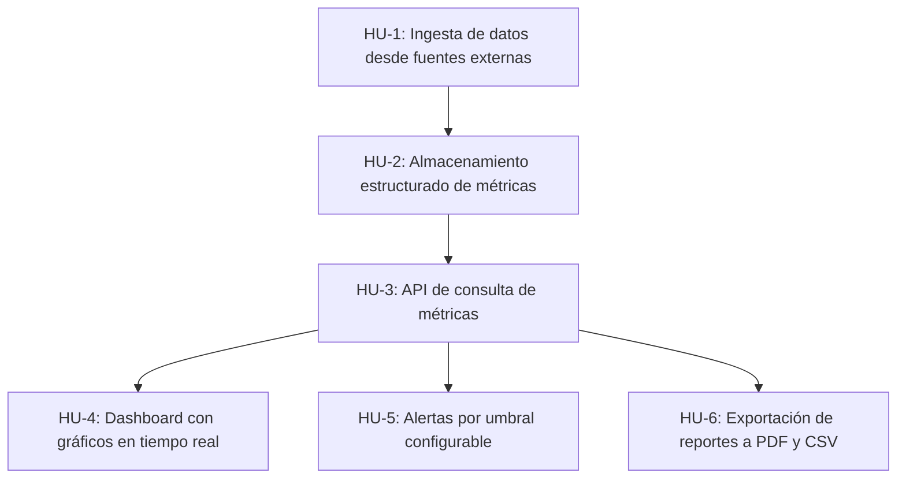

# ROADMAP

## HU-1: Ingesta de datos desde fuentes externas

El sistema puede conectarse a fuentes de datos externas vía webhooks y polling periódico, normalizar los eventos recibidos y enrutarlos al almacenamiento. Soporta al menos dos fuentes simultáneas.

## HU-2: Almacenamiento estructurado de métricas

Los eventos ingestados se transforman en métricas con dimensiones y marcas de tiempo, y se persisten en un esquema optimizado para consultas por rango de fechas y agrupaciones.

## HU-3: API de consulta de métricas

Una API REST permite consultar métricas agregadas por período, dimensión y fuente. Incluye autenticación por API key y documentación OpenAPI.

## HU-4: Dashboard con gráficos en tiempo real

Un usuario autenticado puede visualizar sus métricas en un dashboard con gráficos de línea, barra y torta. Los datos se actualizan en tiempo real sin recargar la página.

## HU-5: Alertas por umbral configurable

Un usuario puede definir alertas que se disparan cuando una métrica supera o baja de un umbral configurado. Las notificaciones se envían por correo electrónico o webhook.

## HU-6: Exportación de reportes a PDF y CSV

Un usuario puede exportar cualquier vista del dashboard como PDF o descargar los datos crudos en CSV, seleccionando el rango de fechas y las dimensiones deseadas.
