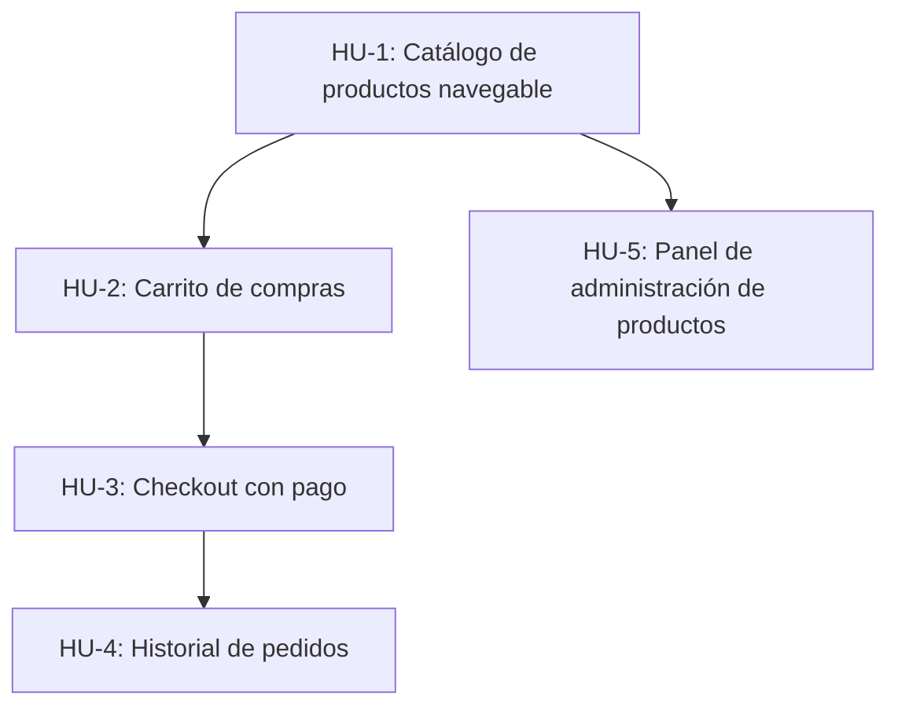

# ROADMAP

## HU-1: Catálogo de productos navegable

Un visitante puede explorar los productos disponibles, filtrar por categoría y ver el detalle de cada uno con fotos, descripción y precio. Es el punto de entrada de toda la experiencia de compra.

## HU-2: Carrito de compras

Un usuario puede agregar productos al carrito, ajustar cantidades y eliminar ítems antes de proceder al pago. El carrito persiste entre sesiones para no perder selecciones.

## HU-3: Checkout con pago

Un usuario con carrito no vacío puede ingresar su dirección de envío y pagar con tarjeta. Al completar el pago recibe un número de orden y un correo de confirmación.

## HU-4: Historial de pedidos

Un usuario autenticado puede ver todos sus pedidos anteriores con su estado actual (pendiente, despachado, entregado) y el detalle de cada uno.

## HU-5: Panel de administración de productos

Un administrador puede crear, editar y desactivar productos desde una interfaz web, sin acceder directamente a la base de datos.
